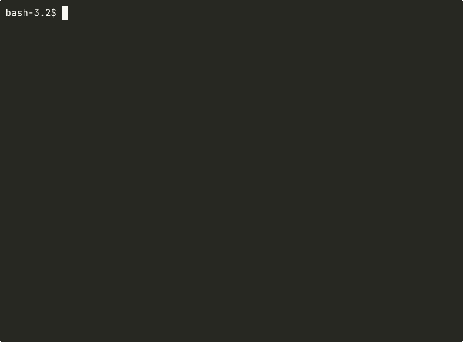

<p align="center"></p>

# Haven

Deploy open-source LLMs to your own cloud with one command. No middlemen, no additional fees, no data leaks. Just your machine, your cloud, your models.



## Motivation

Open-source models are getting powerful enough to be useful for real work. But using them through third-party API providers means trusting someone else with your data — no guarantees it won't be logged, leaked, or used to train the next model.

Haven lets you deploy models to your own infrastructure — with no intermediaries and no fear of sending sensitive information to someone else's servers. It's also just a fast way to experiment without extra overhead or costs beyond the cloud resources themselves.

## How it works

Haven provisions a cloud instance, sets up the model behind an encrypted reverse proxy, and returns a ready-to-use API endpoint with an access key.

- Single binary, no external dependencies
- Infrastructure managed as code — automated provisioning and teardown
- TLS encryption with certificate pinning
- Network access restricted to your IP

## Supported models


| Model         | GPU         | ~$/hr |
| ------------- | ----------- | ----- |
| `llama3.2:1b` | —           | $0.08 |
| `llama3.2:3b` | —           | $0.17 |
| `phi3:mini`   | —           | $0.08 |
| `qwen3.5:4b`  | NVIDIA A10G | $1.01 |
| `qwen3.5:9b`  | NVIDIA A10G | $1.01 |
| `qwen3.5:27b` | NVIDIA A10G | $1.21 |


*Prices are approximate AWS on-demand rates for us-east-1.*

Models can be served by **Ollama** or **llama.cpp**. The default is llama.cpp when the model supports it; use `--runtime ollama` to force Ollama (e.g. `haven deploy llama3.2:1b --runtime ollama`).

## Install

### macOS / Linux (Homebrew)

```bash
brew install yuritur/tap/haven
```

### From source

```bash
go install github.com/havenapp/haven/cmd/haven@latest
```

## Usage

> **Note:** Currently only AWS is supported as a cloud provider. No prior AWS CLI setup is required — Haven will guide you through creating an account and configuring credentials if needed.

```bash
# Authenticate with your cloud provider (once)
haven login

# Deploy a model
haven deploy llama3.2:1b

# Chat with your model
haven chat

# List deployments
haven status

# Estimated and actual cost for a deployment
haven cost [deployment-id]

# Stop instance (pay less while stopped), start when needed
haven stop [deployment-id]
haven start [deployment-id]

# Tear down
haven destroy <deployment-id>
```

## Cost

**`haven cost`** shows estimated cost for a deployment: uptime, estimated total so far, projected cost to end of month, and actual from provider-billing when available. If you have only one deployment, you can run `haven cost` without an ID.

To pay less when you're not using a deployment, **stop** it with `haven stop` — the instance is stopped and you only pay the small ongoing charges (e.g. disk, reserved IP; exact items depend on the provider). Use **`haven start`** to bring it back when needed.

## GPU models and vCPU quotas

AWS accounts have **0 vCPU quota** for GPU instance families (G, P) by default. When you deploy a GPU model for the first time, Haven will detect this and offer to request a quota increase automatically via the AWS Service Quotas API.

Small increases (e.g., 4 vCPUs for a single `g5.xlarge`) are typically auto-approved within a few minutes. Larger requests may take hours and require AWS support review.

If you prefer, use the [AWS Console](https://console.aws.amazon.com/servicequotas/home#!/services/ec2/quotas/L-DB2E81BA) to make the request.

## Use with haven chat or curl

Use `haven chat` to talk to your deployment, or call the API directly:

```bash
curl --cacert data/certs/<deployment-id>.pem \
  https://<ip>:11434/v1/chat/completions \
  -H "Authorization: Bearer sk-haven-..." \
  -H "Content-Type: application/json" \
  -d '{"model":"llama3.2:1b","messages":[{"role":"user","content":"Hello!"}]}'
```

## Use with OpenAI SDK

```python
from openai import OpenAI

client = OpenAI(
    base_url="https://<ip from haven deploy output>:11434/v1",
    api_key="sk-haven-...",  # from haven deploy output
)

response = client.chat.completions.create(
    model="llama3.2:1b",
    messages=[{"role": "user", "content": "Hello!"}],
)
```

## License

MIT — see [LICENSE](LICENSE)